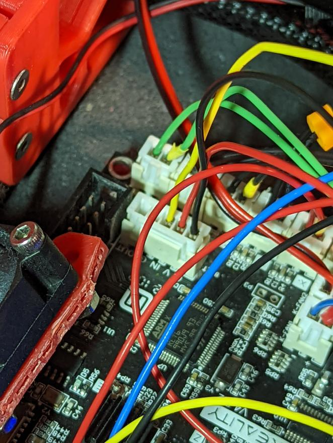
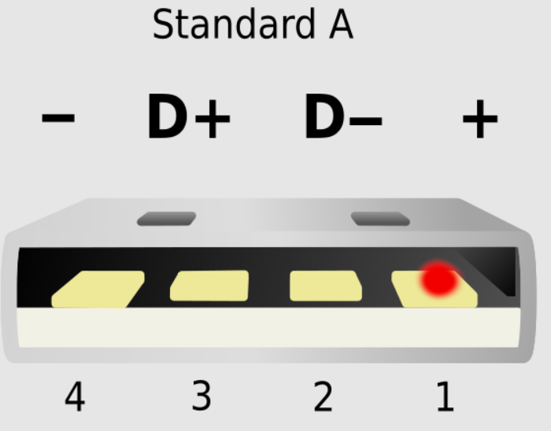

# How to control Neopixel on Stock Ender 3v2 MCU

## Note
check the Servo folder for more infos and pinouts

## Warning

If you are connecting the PI via USB with the MCU then put tape on the 5V Pin (1), see below.
Reason is a design flaw that allowed the MCU to draw power from the PI.


## How To

1. solder not more than a few neopixels in a daisy chain according to the label
2. crimp a 5 port  JST-XHP that goes into the BLtouch port, see picture (GND to GND [black], 5V to 5V [red], Data to PWM [yellow])
3. Get an LED klipper config from command ref or Voron SB repo
4. Use `pin: PB0` with `color_order: GRBW`


## Connection
* Black = GND
* Red = 5v
* Yellow = Data

**go one folder up to see full 4.2.2 and 4.2.7 pinouts**




## Example klipper config

```
[neopixel sb_leds]
pin: PB0
#   The pin connected to the neopixel. This parameter must be provided.
chain_count: 3
#   The number of Neopixel chips that are "daisy chained" to the
#   provided pin. The default is 1 (which indicates only a single
#   Neopixel is connected to the pin).
color_order: GRBW
#   Set the pixel order required by the LED hardware. Options are GRB,
#   RGB, GRBW, or RGBW. The default is GRB.
initial_RED: 1.0
initial_GREEN: 0.0
initial_BLUE: 1.0
initial_WHITE: 0.0
#   Sets the initial LED color of the Neopixel. Each value should be
#   between 0.0 and 1.0. The WHITE option is only available on RGBW
#   LEDs. The default for each color is 0.#

```
See full config and lightsetting at
https://github.com/VoronDesign/Voron-Stealthburner/blob/main/Firmware/stealthburner_leds.cfg


## Backpower fix


