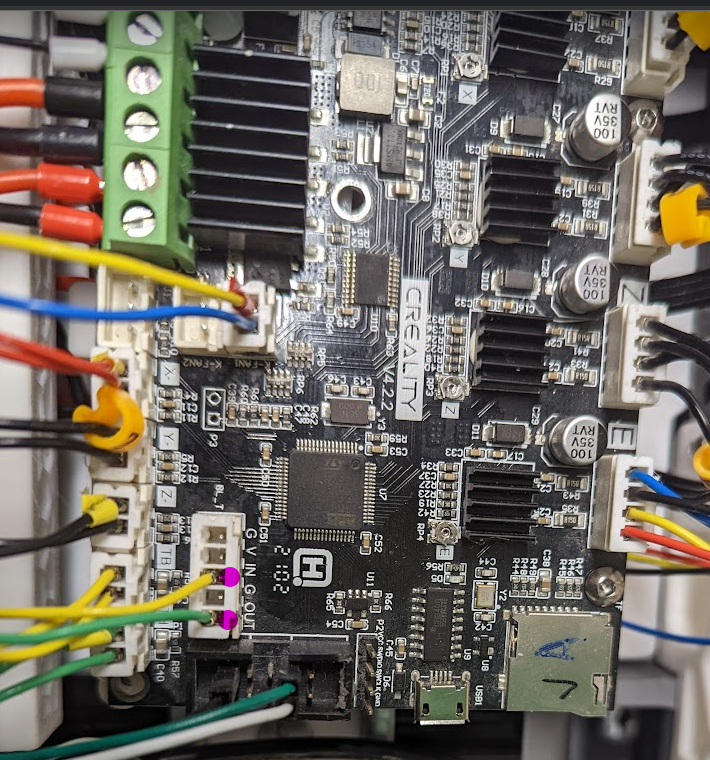
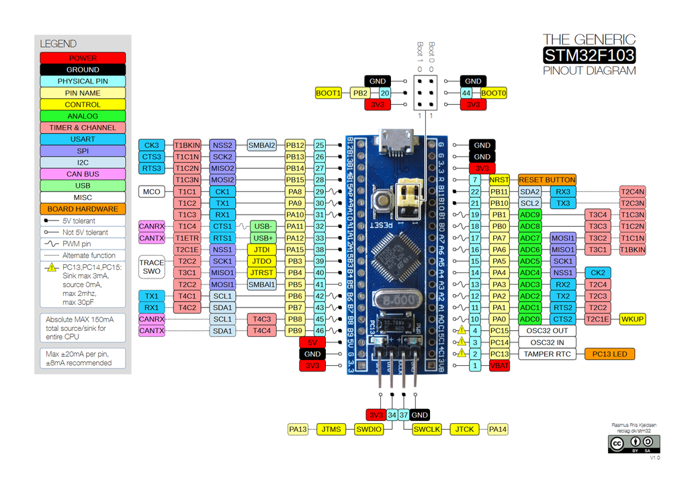
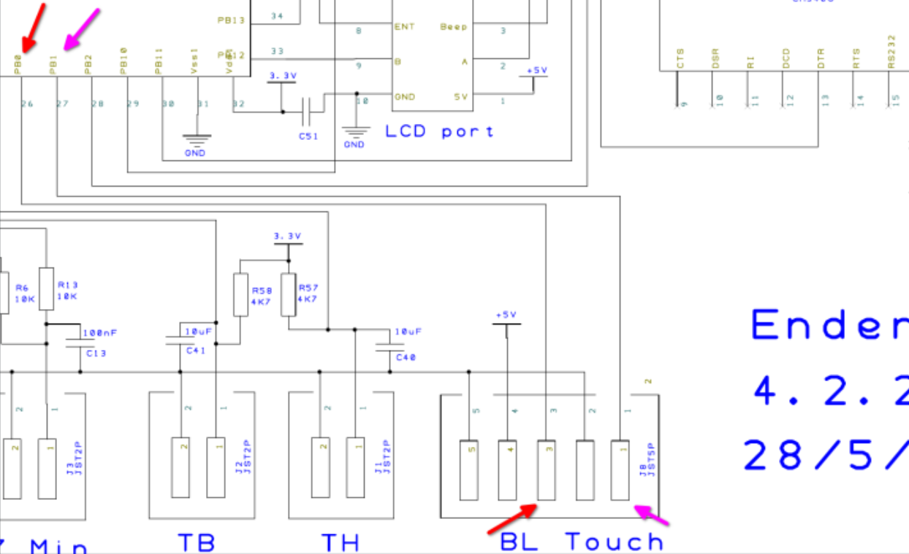

# How to control Neopixel on Stock Ender 3v2 MCU

## Warning

DO NOT draw the power for the servo from the BLtouch port.

3 Neopixel are fine tho.


## How To


1. If not already for the Neopixel crimp a 5 port  JST-XHP that goes into the BLtouch port
2. connect the Data Wire [yellow] to one of the PWM Port (1 and 3) see below
3. you likely now want to head over to https://github.com/jlas1/Klicky-Probe/tree/main/Printers/Voron/Switchwire


## BLTouch Pinout

* Pin 1: PB1 PWM Signal (Servo/Pixel or alike)
* Pin 2: GND
* Pin 3: PB0 PWM Signal (Servo/Pixel or alike)
* Pin 4: 5v (should have a 300mA rating)
* Pin 5: GND

This is should look like this, using servo (green cable) and Neopixel (yellow cable) while power comming from the RS25-5



see below for the pinout diagrams

## Example klipper config

```
[servo klicky_servo]
pin: PB1  # bltouch port
maximum_servo_angle: 180
minimum_pulse_width: 0.00025
maximum_pulse_width: 0.0024


```
## Extra note

might need to increase `horizontal_move_z` to like 15 for `[bed_mesh]` and `[screws_tilt_adjust]` as the Unklicky sticks out a lot

## Pinouts

**go one folder up to see full 4.2.2 and 4.2.7 pinouts**





